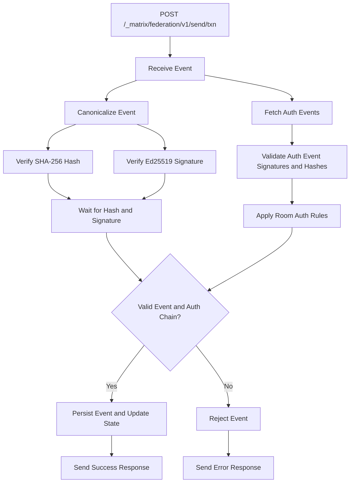

```mermaid
flowchart TD
  A[POST /_matrix/federation/v1/send/txn] --> B[Receive Event]

  B --> C[Canonicalize Event]

  C --> D1[Verify SHA-256 Hash]
  C --> D2[Verify Ed25519 Signature]
  B --> E[Fetch Auth Events]

  D1 --> F[Wait for Hash and Signature]
  D2 --> F

  E --> G[Validate Auth Event Signatures and Hashes]
  G --> H[Apply Room Auth Rules]

  F --> I{Valid Event and Auth Chain?}
  H --> I

  I -->|Yes| J[Persist Event and Update State]
  I -->|No| K[Reject Event]

  J --> L[Send Success Response]
  K --> M[Send Error Response]
```